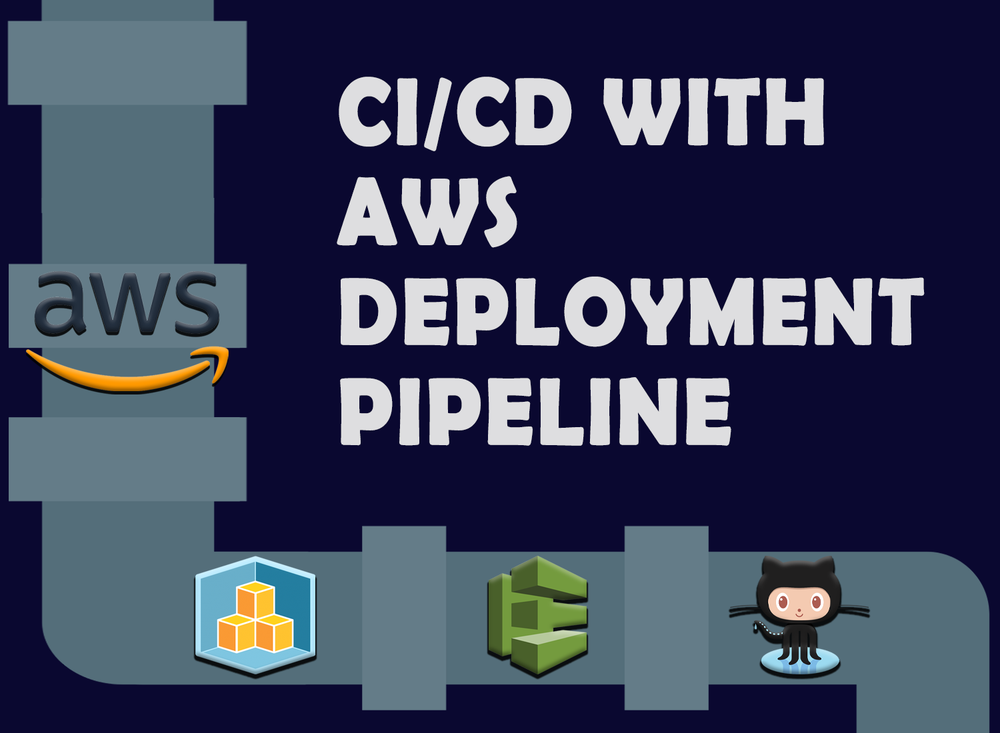
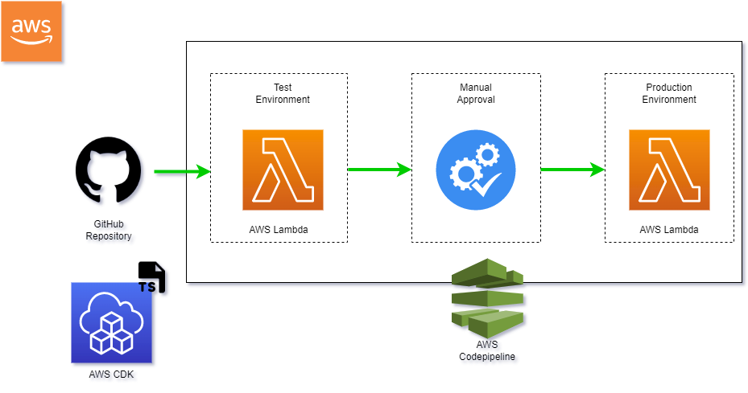

# Welcome to CI/CD With AWS CodePipeline
## How To Create a Deployment Pipeline for a CDK App Using AWS CodePipeline and GitHub

Medium article link: https://pawara73.medium.com/ci-cd-with-aws-codepipeline-a452c5b88c60

<table>
    <tr>
        <th> Project architecture</th>
        <th> Complete pipeline</th>
    </tr>
    <tr>
        <td></td>
        <td></td>
    </tr>
</table>

## Useful commands

1. Download and install AWS CLI  
   https://docs.aws.amazon.com/cli/v1/userguide/install-windows.html#install-msi-on-windows

2. Install cdk
    - `npm i aws-cdk@2.17.0`

3. To configure the AWS Account and CDK:  
    - To create Iam User: https://cdkworkshop.com/15-prerequisites/200-account.html#administrator-user 
    - To configure the AWS credentials: https://cdkworkshop.com/15-prerequisites/200-account.html#configure-your-credentials

### After cloning the repo:

1. Install node modules:
    - `npm install`

2. Modify the following files according to the comments given.
    - aws-codepipeline-project.ts
    - aws-codepipeline-project-stack.ts

3. To bootstrap the environment (to create cdk.out):
    - `cdk bootstrap`

4. To deploy the pipeline:
    - `cdk deploy`
